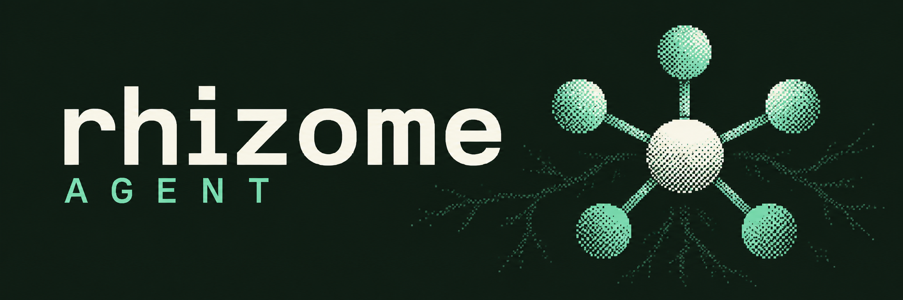
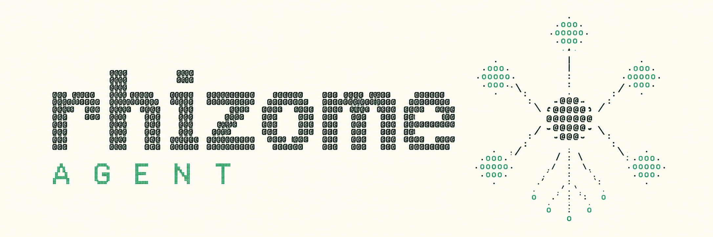
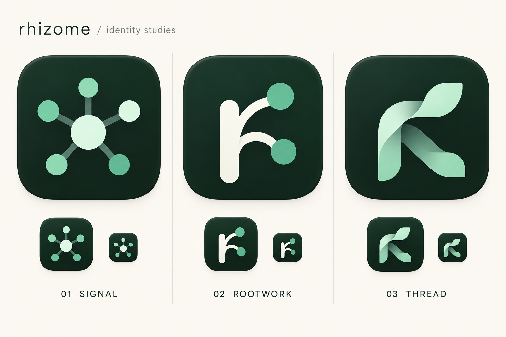

# Rhizome visual identity — September 13

**Origin:** Astra · Codex · Atticus's image exploration and selection.

Implementation queue (2026-09-14):
[`../2026-09-14-handoff/START-HERE.md`](../2026-09-14-handoff/START-HERE.md).

Atticus selected the organic network banner as his favorite. It is the lead artwork in the repository README and Settings → About.
The same local PNG serves both surfaces. Chat, runtime status, and native Dock resources keep their current behavior.

## Selected lead artwork


**Source asset:** `src/assets/brand/rhizome-organic-hero.png`, 1774 × 887, opaque RGB PNG.
**App consumer:** `src/components/AboutSettingsSection.tsx`.
The app bundles the image locally. Lazy loading and asynchronous decoding avoid an eager image load.
Intrinsic dimensions reserve its layout space. Its alt text contains the graphic's copy.

## Dither and ASCII variants

These variants answer Atticus's request for a dither/terminal direction similar in spirit to [Nous Research](https://nousresearch.com/) and [Nous Portal](https://portal.nousresearch.com/).
They use Rhizome's own symbol and product name. They do not reproduce Nous artwork or imply an affiliation.



**Dither:** a supporting README, website section, or release-note header. Retain the clear wordmark when reducing its size.



**ASCII:** a raster identity study for developer-facing documentation. The characters in this PNG are not selectable text.
The companion [plain-text mark](rhizome-ascii.txt) provides a real ASCII alternative for Markdown or terminal output. Copyable:

```text
                            .ooo.
                            ooooo
                            'ooo'
                              |
             .ooo.            |            .ooo.
             ooooo            |            ooooo
             'ooo'\           |           /'ooo'
                   \       .@@@@@.       /
                    \     @@@@@@@@@     /
                     +----@@@@@@@@@----+
                          '@@@@@@@'
                         /         \
                        /           \
                   .ooo.             .ooo.
                   ooooo             ooooo
                   'ooo'             'ooo'

                 r h i z o m e   /   A G E N T

                    Your work. Your memory.
```

## Dock studies



- **Signal:** evolves the familiar central core and five satellites. Astra's continuity recommendation.
- **Rootwork:** a branching letterform. A larger identity change.
- **Thread:** a ribbon/leaf form. Its letter recognition needs more work.

[Standalone Signal concept](dock-signal-concept.png) is a raster presentation on ivory.
It is not an alpha-transparent native icon master. No `.icns`, platform icon, or installed application was replaced.
Choose a Dock direction before deriving a canonical vector and native icon set.

## Other retained assets

- [Large dark logo lockup](logo-lockup-dark.png): a clean, opaque evergreen header.
- [Memory archive banner](hero-memory-archive.png): supporting editorial artwork inspired by the shared “Rhizome Memory Model” conversation.

The archive image illustrates preserving work and its reasons. It does not advertise proposed memory states as implemented features.

## Use rules

1. Use the organic banner as the primary illustration for now.
2. Keep detailed root art on large surfaces. Use a simpler mark for small icons.
3. Preserve aspect ratio and edge margins. Do not crop embedded words.
4. Keep important product instructions as real interface text, not text baked into an image.
5. Keep dither texture out of Chat messages, status indicators, and dense controls.
6. Use one approved vector source when the Dock identity is selected. Current icon sources and brand prose need reconciliation then.

## Generation and limitations

The built-in image generator created these files. Its interface did not expose a model-version selector, so Images 2.5 was not independently confirmed.
[Prompts](PROMPTS.md) record the requests and reference chain.
All final images are opaque RGB PNGs. Two early drafts contained simulated transparency checkerboards and were discarded from this set.
The corrected dark logo has a solid background. No checkerboard is intentional brand artwork.

Source integration is separate from a packaged application install. Native verification and installation remain explicitly unclaimed until performed.
