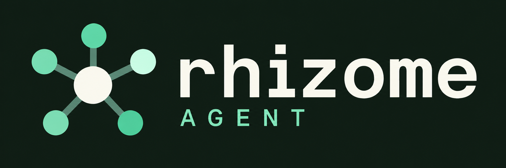
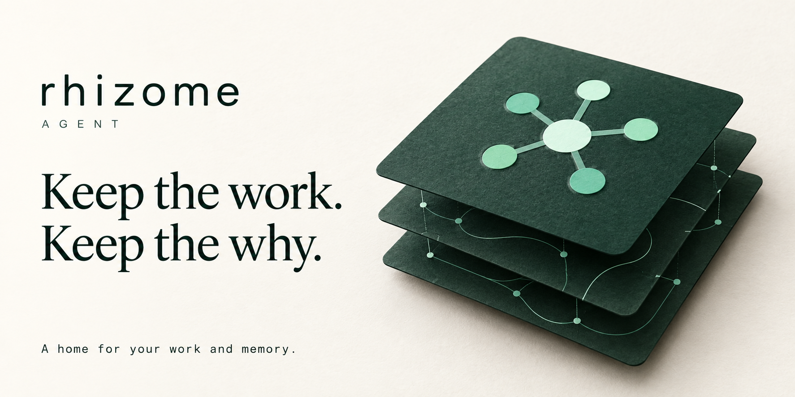
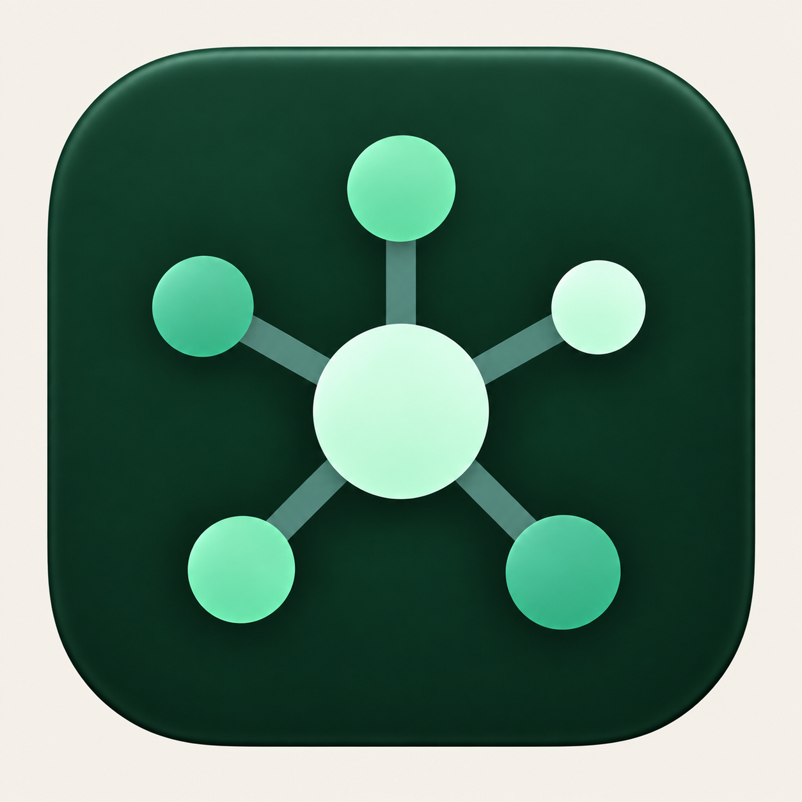

# Rhizome design assets

**Origin:** Astra pack · 2026-09-14. In-tree links: Cursor Grok 4.6 · D4.

**Selected direction:** Atticus chose the organic network banner as his favorite.
All seven final image concepts from this design session are preserved here with their prompts and intended use.
Use [START-HERE.md](START-HERE.md) for Cursor's implementation instructions.

Images already live in the repository. This folder does not copy the PNGs.
Organic hero: `src/assets/brand/rhizome-organic-hero.png`.
Everything else: `docs/design/brand/2026-09-13/`.
Zip-name map: [INTEGRATION.md](INTEGRATION.md).

## Lead artwork — selected

Use in the README and Settings About. Both already reference this artwork in repository source.
For a future website, use it as a broad hero illustration. Keep important page copy as real text.
At narrow widths, show the whole image or use a separately prepared art-only crop with live text. Never crop through embedded words.

## Supporting artwork and actual placement

| Asset | Role | Cursor action |
|---|---|---|
| [Dither banner](../2026-09-13/banner-dither.png) | Developer documentation header | Place in the design/developer gallery. Optional existing onboarding slot only if it adds clarity. |
| [ASCII artwork](../2026-09-13/banner-ascii.png) | Terminal-inspired identity study | Preserve in the developer gallery. This PNG is not selectable text. |
| [Real ASCII](../2026-09-13/rhizome-ascii.txt) | Copyable text mark | Fenced in the [developer gallery](../2026-09-13/README.md). Keep it out of JSON or protocol output. |
| [Dark logo lockup](../2026-09-13/logo-lockup-dark.png) | Broad dark website/docs header | Reserve for a header that needs a wordmark without the full illustration. Do not put it beside a duplicate wordmark. |
| [Memory archive](../2026-09-13/hero-memory-archive.png) | Editorial illustration of retained work | Pair with the memory design note. Describe it as a concept, not a screenshot or shipped memory-state feature. |
| [Dock directions](../2026-09-13/dock-icon-directions.png) | Comparison of Signal, Rootwork, and Thread | Keep in the identity decision gallery. Signal is Astra's recommendation, not Atticus's selected Dock design. |
| [Signal Dock concept](../2026-09-13/dock-signal-concept.png) | Reference for a continuity-focused icon study | Compare against the canonical vector at small sizes. Do not install this raster presentation. |

Each asset has a home. Reuse does not require putting seven competing logos inside the app.

## Dither

The requested reference was the dither/terminal feeling associated with Nous Research and Nous Portal.
This artwork uses Rhizome's own mark and name. It does not reproduce Nous artwork or imply affiliation.
Keep the texture on illustration surfaces. It should not reduce transcript or status legibility.

## ASCII

The companion text file is the real copyable alternative. Retain monospace formatting and whitespace.
Copyable fence: [2026-09-13 README](../2026-09-13/README.md).

## Dark lockup

The background is intentionally solid evergreen. The original simulated transparency checkerboard was an error and was replaced.

## Memory archive

See [MEMORY-DIRECTION.md](MEMORY-DIRECTION.md) for the distinction between existing provenance and proposed memory states.

## Dock studies

Signal retains a core and five asymmetric satellites. Rootwork and Thread represent larger identity changes.
The standalone presentation has an opaque ivory field outside its tile. It is not a transparent icon master.
Derive any future native icon from an approved vector. Keep all platform resources consistent with that source.

## Asset handling

Preserve originals. Use separate filenames for optimized derivatives. Keep aspect ratio and wordmark spelling intact.
Do not use CSS filters to recolor the selected artwork. Let the containing surface use the app's theme.
The artwork embeds English copy. Important instructions and product actions must remain real accessible UI text.
Bundle only the assets that an app surface actually consumes. Keep alternate concepts in documentation.
All seven PNGs are opaque RGB. None contains an alpha channel. No checkerboard is intended.

The built-in image generator created the artwork. Its interface exposed no model-version selector.
Images 2.5 was requested by the user but was not independently confirmed as the underlying model.
[PROMPTS.md](PROMPTS.md) preserves the generation requests, including the failed transparency requests and their corrections.
[ASSET-MANIFEST.json](ASSET-MANIFEST.json) records dimensions, file sizes, and checksums.
