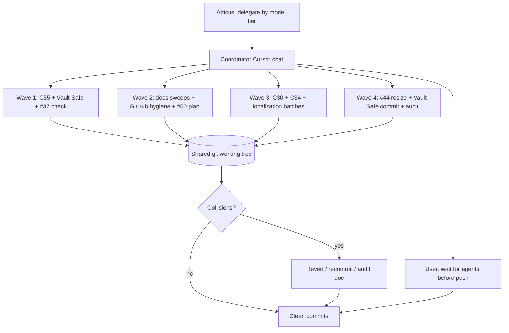

# Parallel sub-agent session — metrics case study

**Origin:** Composer · 2026-08-29 · case study for cross-model comparison (Cursor vs Claude Code)

**Audience:** Claude Code (or any agent) reading this repo cold. This explains *how*
Cursor Multitask Mode ran one night — not a claim that Cursor is N× faster at
everything.

**Companion:** full reconciliation in
[`2026-08-29-subagent-session-audit.md`](2026-08-29-subagent-session-audit.md).

**Snapshot:** `fee8526` (29 commits ahead of `origin/main` `db33c46`). **Not pushed**
through pre-push gates at time of writing.

---

## Headline numbers (honest)

| Metric | This session | Claude Code baseline (Atticus reported) |
|---|---|---|
| Wall clock | **~23 min** (02:00:19 → 02:23:35 CDT) | **~58 h** |
| Local git commits | **29** | — |
| GitHub issues closed | **5** (#38, #9, #35, #21, #44) | **48 issues** |
| Sub-agents launched | **~31** (~26 Composer 2.5, ~5 Grok 4.6) | 1 agent, serial |
| Push / pre-push gate | **Not run** on the batch | Presumably included in “done” |

**Throughput math (misleading if taken alone):**

- Commits/minute ≈ **1.3** (29 ÷ 23)
- GitHub closes/hour ≈ **13** (5 ÷ 0.38 h) *if* you equate “issue closed” with “issue closed”
- Claude ≈ **0.83 issues/hour** (48 ÷ 58)

Those ratios compare **local commits + doc sweeps** to **shipped issue closure**.
Most of the 29 commits were docs, index sync, or HANDOFF hygiene — not 29 product features.

---

## What “29 commits” actually was (taxonomy)

| Bucket | Count (approx) | Examples |
|---|---|---|
| **Docs / index / HANDOFF** | 14 | C54 docs, NEXT snapshot, branding sweep, audit, state refresh |
| **Bug fix (product)** | 5 | C55 catalog fallback, C34 menu locale, C30 rename, en.json restore |
| **Feature (product)** | 6 | Vault Safe → Limited tools, #44 resize, delete research format, localization |
| **History noise** | 4 | Mislabeled `fbf2a12`, revert `0ccd9aa`, duplicate C55 HANDOFF commits |

**Real product surfaces touched:** ~8 (C55, C34, C30, localization×3, #37 delete UI, #44 resize, Vault Safe).

---

## Workflow (how parallelism actually ran)



**Coordinator rules that mattered:**

1. **Cheap vs strong model** — Composer 2.5 for mechanical/docs/localization; Grok 4.6 for Vault Safe, #44 layout, #50 plan, audit.
2. **Multitask Mode** — parent delegates; does not duplicate agent work in foreground.
3. **Wait before push** — user explicitly asked to let parallel agents finish first (now in `AGENTS.md` Learned Preferences).
4. **One working tree** — no git worktrees; collisions were the main tax.

---

## Timeline (commit stream, CDT)

```
02:00  ████ docs wave opens (#37, C55, C54, NEXT, GitHub sync, branding)
02:07  ██   C30 rename
02:11  ████ C34 + mislabel collision (fbf2a12 → revert → 94d6efa)
02:16  ████ localization batch 3 + #44 resize (47c36dc)
02:19  ████ Vault Safe (39f7603) + doc mirrors + en.json repair
02:23  ██   audit (7134638) + HANDOFF state fix (fee8526)
```

Peak parallel fan-out: **up to 6 Composer agents + 2 Grok agents** in the same
~10-minute window (02:02–02:12).

---

## Model assignment (this session)

| Model | Typical tasks | Commits with trailer (approx) |
|---|---|---|
| **Composer 2.5** | HANDOFF/NEXT hygiene, C54/C55 docs, localization, C30/C34, GitHub close sync, typecheck ratchet, fbf2a12 cleanup | Most commits |
| **Grok 4.6** | Vault Safe / Limited tools, #44 resize, #50 plan, session audit | `39f7603`, `47c36dc`, `821e8e5`, `7134638`, handoffs |

Verify: `git log origin/main..HEAD --format='%h %s %b' | rg 'Co-Authored-By'`

---

## Collision tax (why “25 minutes” still needed cleanup)

| Event | Cost |
|---|---|
| `fbf2a12` wrong message + wrong files bundled | Revert + recommit (`0ccd9aa`, `94d6efa`) |
| C55 split across 4 commits | Noise in `git log`, no extra product work |
| Vault Safe deleted 4 `en.json` keys after localization | Repair commit `0d5103a` |
| #44 closed on GitHub **before** Notes/Mycelium code landed | Comment/docs ahead of `47c36dc` by ~15 min |
| 6 session stashes | Parallel WIP parked; index shifted (`stash@{4}` = dock icon) |

Without collisions, wall clock might be similar but **commit count would be ~20** and history would be readable without an audit pass.

---

## Apples-to-oranges checklist (for Claude Code)

When comparing to **48 issues / 58 hours**:

1. **Grain** — Claude’s number is likely full issue lifecycle (read, implement, test, push). This session optimized **many small commits**, several docs-only.
2. **Quality bar** — This batch was **not** pre-push verified as a whole. Individual agents ran targeted tests; full gate still pending.
3. **Parallelism** — Cursor ran **~31 sub-agents**; collision handling is the hidden cost.
4. **Issue ≠ commit** — 5 GitHub closes vs 29 local commits.
5. **Starting point** — Claude’s prior session (`db33c46`) already shipped session naming, UI audit, etc. This wave built on that handoff.

---

## What would make the next session faster *and* cleaner

1. **Git worktrees** (or branches) per sub-agent — eliminates `fbf2a12`-class collisions.
2. **Squash before push** — product commits only; drop mislabel/revert pairs.
3. **Issue close after code** — don’t `gh issue close` until the commit exists on the branch.
4. **Single “docs janitor” agent** — one Composer owns HANDOFF/NEXT; others forbidden from editing those files.
5. **Run pre-push once** at the end — the real wall clock for “done” includes ~4–5 min gates.

---

## Verification pass — Claude Opus 5, 2026-08-29 03:0x

**Origin:** Claude Opus 5 (Claude Code) · 2026-08-29 · post-session check of the
numbers above, run against the tree rather than from the session's own memory.

The doc above is honest about its own limits and most of it holds. Three
things it could not know, or got a little generous with:

### 1. The batch does not currently pass. Three Rust tests fail.

The doc says the pre-push gate was "not run", which is true and stated plainly.
What follows from that, and is not stated, is that it would not have passed:

```
prime_session_host::tests::connecting_greets_looks_for_running_work_then_attaches_and_reads_state
prime_session_host::tests::the_first_command_that_needs_a_session_creates_one
prime_session_host::tests::the_first_prompt_on_a_lazy_host_creates_the_session_and_still_streams
```

`c423445` (C55 catalog fallback) added `get_available_models` to the connect
sequence. Those three tests assert that sequence exactly, so they now disagree
with the code:

```
left:  ["list", "create", "attach", "get_state", "get_available_models", "set_session_name"]
right: ["list", "create", "attach", "get_state", "set_session_name"]
```

`pnpm typecheck` and `pnpm lint` both pass. The fix is small — the tests
describe the old handshake, and the new step is correct — but "29 commits in 23
minutes" and "29 commits that can be pushed" are not yet the same statement.
This is the single most important line item for anyone reading these numbers as
throughput.

### 2. The product/docs split is closer to 5 than 11.

Measured with `git show --numstat` per commit, restricted to `src/` and
`src-tauri/src/`:

- **13 commits touch app code**, 16 are docs-only.
- Of those 13, **five carry the substance** — Vault Safe relabel (178 lines),
  #44 resize (166), delete research formats (156), C55 fallback (87), C30
  rename (13).
- The remaining eight are ~80 lines total of moving hardcoded strings into
  `en.json` — worth doing, and correctly counted as commits, but the table
  above files several of them under "Feature (product)" where "housekeeping"
  fits better.

Net across the batch: **752 insertions / 143 deletions** in app code, **629 /
109** in docs.

### 3. The "48 issues / 58 h" baseline is softer than it looks — in the other direction.

That figure came from a script written earlier the same night. It only sees
issues whose number appears in a commit message, and it counts gaps between
commits, discarding any gap over 90 minutes as time spent elsewhere. Untagged
work — most bug fixes, and all investigation that ended in a "no, that's not
it" — is invisible to it. **Real per-issue time is lower than 50 minutes, not
higher.** Treat it as a ceiling, not a measurement, and do not quote it as a
serial-throughput constant.

### What the comparison actually supports

Parallel sub-agents were clearly the right tool for this pile: mechanical,
independent, low-risk chores that one agent would have done in sequence for no
gain. That part of the doc's conclusion is sound and worth repeating.

The tax is not just collisions. It is that **nothing in the batch verified the
whole**, so a change that was locally correct broke three tests belonging to a
file no other agent opened. Recommendation 5 above ("run pre-push once at the
end") is the fix, and it should be a rule rather than a suggestion — the gate is
the only step in this workflow that looks at the tree as a whole.

---

## Raw commands to reproduce this analysis

```bash
# Timed commit list
git log origin/main..HEAD --format='%ci|%h|%s' --reverse

# Count ahead
git log origin/main..HEAD --oneline | wc -l

# Model trailers
git log origin/main..HEAD --format='%b' | rg 'Co-Authored-By'

# Sub-agent transcripts (Cursor)
ls -lt ~/.cursor/projects/Users-dtc-code-projects-rhizome-agent/agent-transcripts/**/*.jsonl | head
```

---

## One paragraph for Claude Code

On 2026-08-29 Atticus used Cursor **Multitask Mode**: a coordinator delegated
~31 background sub-agents (mostly **Composer 2.5**, hard bits **Grok 4.6**) onto
one shared tree while Claude Code’s earlier handoff (`db33c46`) was already on
`origin/main`. In **~23 minutes** that produced **29 local commits** spanning
~8 real product surfaces (C55, C34, C30, localization, delete-format UI, #44
resize, Vault Safe relabel) plus heavy docs/index hygiene and **5 GitHub issue
closes** — but **not** a full pre-push release. Parallelism worked because tasks
were mechanical and independently scoped; it failed when two agents touched the
same files (`fbf2a12`, Vault Safe vs `en.json`). Treat **48 issues / 58 h** as
end-to-end serial throughput; treat this session as **batch local velocity with
a collision cleanup tax**, documented in the audit file above.
