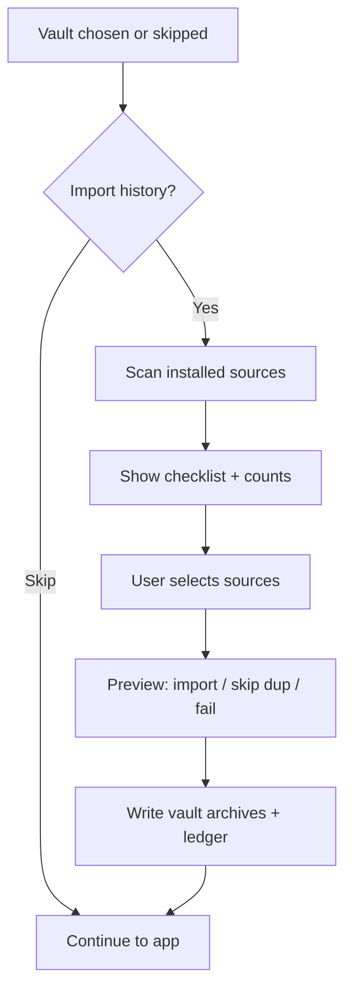

# Import sessions from other harnesses — plan

**Origin:** Cursor · 2026-09-01 · user request (session import + dedup)

**Status:** design only — awaiting Atticus approval on remaining open items.
**Decided 2026-09-01:** **Both when vault attached** — always import to **Prime
session list**; also write a vault note under `Imports/` when a vault is open.
If no vault: session list only. Fuzzy dup UI = review sheet when ≤10.
Cross-harness dedup (any reimport chain).

**Relates to:** #23 (sessions as searchable knowledge), C9 (optional first-run
Welcome), ADR-0168 (absorb artifacts, not runtimes). Does **not** replace
Prime as the live engine; imports are **artifacts** we convert and store.

---

## One paragraph

Let people optionally bring chat history from Hermes, Claude Code, Cursor,
ChatGPT, and (later) other exporters into Rhizome Agent on **first startup**
and from **Settings → Import history**. Each import run writes a durable
**ledger** so re-running a source or importing a second source does not
duplicate threads — including when any harness already holds sessions re-imported
from another app. **Always import to Prime sessions** (session list, like
Cursor/Claude). **When a vault is attached**, also write a vault note under
`Imports/` so the thread is searchable long-term memory. No vault → session
list only; no blocking.

---

## Problem

People arrive with years of threads scattered across tools. Competitors reduce
switching cost by parsing known export formats. Rhizome today only lists
**Prime-native** sessions (`~/.prime/agent/sessions/*.jsonl`) and has no UI
for Prime’s `import_jsonl`. Onboarding without import feels like starting
from zero.

Cross-source dedup is not optional. Many users have **nested** history: any
harness may already hold threads that came from another (Cursor holding Claude
logs, Hermes holding a ChatGPT export, an IDE reimport, etc.). Without a
ledger, provenance chain, and content fingerprints, Rhizome would show the
same conversation twice under different names — regardless of which pair of
apps is involved.

---

## Product principles

1. **Optional everywhere.** First-run wizard offers import with **Skip** and
   **Remind me later**. Settings exposes the same flow anytime.
2. **Explicit consent.** Read-only scan of known folders; show counts before
   import; never silently mutate third-party app data.
3. **Artifacts, not organs** (ADR-0168). We convert transcripts and metadata;
   we do not embed Hermes/Claude/Cursor runtimes.
4. **Both when vault attached** (Atticus, 2026-09-01) — Prime session always;
   vault note when a vault is open. Matches other harnesses for chat UX and
   Rhizome’s memory story without requiring a vault to import.
5. **Idempotent imports.** Same source session imported twice → skip (or
   update-in-place if user chooses). Same *content* from two sources → skip
   the weaker copy.
6. **No secrets in the ledger.** Strip API keys, tokens, and tool outputs that
   match existing `redactCredentialTokens` patterns before fingerprinting or
   writing files.

---

## Surfaces

| Surface | Behavior |
|---|---|
| **First-run Welcome (extends C9)** | After vault pick: “Import chat history?” → multi-select sources → preview → import or skip. If vault attached, notes land under **`Imports/<source>/`**. |
| **Settings → Import history** | Re-scan, import new, view ledger, open **`Imports/`** in Browse, remove from Rhizome only. |
| **Notes Browse — Imports** | Dedicated folder entry (and optional **Imported Session** type section) for quick session lookup without mixing into All Notes. |
| **Session list (optional v2)** | Badge “Imported from Cursor”; link to vault note when `vaultNotePath` exists. |

PostHog (when built): `session_import_started`, `session_import_completed`
with `{ sources[], imported, skipped_duplicate, skipped_empty, failed }` —
no titles or message text.

---

## Source adapters (v1 scope)

Each adapter implements one interface:

```text
scan() → ImportCandidate[]     # discover on disk; no writes
parse(candidate) → NormalizedTranscript
fingerprint(transcript) → ImportFingerprint
```

**NormalizedTranscript** (internal, not Prime’s wire format):

- `messages[]`: `{ role, content, timestamp?, toolSummary? }`
- `title?`, `createdAt`, `updatedAt`
- `sourceApp`, `sourceSessionId`, `sourcePath`
- `provenance?`: `{ kind: 'native' | 'reimported', originalApp?, originalSessionId? }`
- `cwd?`, `model?` (metadata only)

Verify paths on the implementation machine before locking docs — clients move
storage between releases.

| Source | Likely location (verify at slice 1) | Notes |
|---|---|---|
| **Claude Code** | `~/.claude/projects/<encoded-cwd>/*.jsonl` | Canonical for Claude terminal sessions. Project encoding varies. |
| **Cursor** | macOS: `~/Library/Application Support/Cursor/User/workspaceStorage/` and/or `globalStorage/` | May contain composer chats; check for embedded `importedFrom` / export metadata if present. |
| **ChatGPT** | User-provided **export ZIP/JSON** (OpenAI account data export) | No stable default path; file picker only. |
| **Hermes Agent** | Hermes session store under user config (verify against installed Hermes docs) | Separate runtime; treat as export/read, not live attach. |
| **Prime (same machine)** | `~/.prime/agent/sessions/*.jsonl` | Not “other client” but useful for “I used Prime CLI before Rhizome” — optional checkbox, uses native shape. |

**Out of v1:** Claude.ai web, Copilot, Windsurf, automatic cloud sync, skills
bulk import (separate subsection below).

---

## Destination: where imports land

### A. Prime live session (always)

Convert `NormalizedTranscript` → Prime **JSONL import shape**, call daemon
`import_jsonl`. Imported threads appear in the **session list** — same UX as
Cursor/Claude. Runs with or without a vault attached.

> ⚠️ **Verified 2026-09-05 — `import_jsonl` does not do what this section
> assumes, and this is unresolved.**
>
> Checked against Prime 0.8.0's own docs and installed source, not the adapter
> snapshot (which lists the command's name but never its behaviour):
>
> - `docs/daemon.md:27`: "New, switch, fork, and import operations **replace the
>   root runtime inside the worker** while preserving the public active-session
>   ID."
> - `dist/modes/agent-connection/daemon-agent-connection.js:1094`:
>   `importFromJsonl(inputPath, cwdOverride)` sends `{ type: "import_jsonl",
>   activeSessionId, inputPath, cwdOverride }`.
>
> So `import_jsonl` **replaces the contents of the active session**. It does not
> mint a list entry per call. Calling it N times imports N threads into the same
> session, one after another, keeping only the last — not N rows in the session
> list.
>
> The session list is the set of files in `~/.prime/agent/sessions/<uuid>.jsonl`,
> and `prime_sessions.rs` states plainly that Rhizome touches nothing in that
> directory (consistent with ADR-0163: we are a client of the daemon, not its
> owner).
>
> **Three routes, none of them free — needs a decision before Slice 0's writer
> is built:**
>
> 1. **`new_session` then `import_jsonl`, per thread.** Uses only public
>    commands. But it is two daemon round trips per thread, it displaces the
>    user's working session on every one of them, and importing a few hundred
>    threads means a few hundred session switches. Whatever session the user had
>    open is not where they left it afterwards.
> 2. **Write converted JSONL straight into `~/.prime/agent/sessions/`.** One
>    file per thread, appears in the list immediately, no daemon traffic and no
>    session displacement — but it writes into Prime's own store, which both
>    `prime_sessions.rs` and ADR-0163 say we do not do. It would also break if
>    Prime changes its on-disk shape.
> 3. **Vault-only import, drop the session-list destination.** Contradicts the
>    decided "always import to Prime sessions", and gives no import at all to a
>    user with no vault attached.
>
> Route 1 is the only one that respects the existing boundary, so it is the
> default unless Atticus says otherwise — but its session-displacement cost is
> real and worth knowing before it is built. Do not treat the "always import to
> Prime sessions" decision as settled against this constraint; it was made
> before the constraint was known.

### B. Vault archive (when vault attached)

On every successful import, **if a vault is open**, also write one note into a
**dedicated vault area** so imported sessions are easy to find without hunting
through All Notes.

#### Layout (decided — Atticus, 2026-09-01)

```text
vault/Imports/                          ← top-level folder (always)
  <source>/                             ← one subfolder per harness (claude, cursor, …)
    <yyyy-mm-dd>-<slug>.md
```

**Why a folder + source subfolders:** “I’m looking for that Cursor thread” →
open **Imports → cursor**. “Anything imported?” → **Imports** only. Keeps
imported history out of normal note types unless the user promotes a thread.

#### Sidebar / Browse (v1 slice 1 or 2)

- **Notes panel Browse:** treat `Imports/` as a first-class entry — same idea as
  type sections, but folder-scoped (list everything under `Imports/` or drill
  into `<source>/`).
- **Frontmatter** uses a dedicated type so imported sessions can also appear
  under one sidebar category when the vault indexes by type:

```yaml
type: Imported Session
source_app: cursor
imported_at: 2026-09-01T…
prime_session_id: "…"
rhizome_import: true
content_fingerprint: "<sha256>"
provenance: native | reimported
original_app: claude   # when known
```

(`type: Imported Session` is the **category** for quick lookup; path stays
under `Imports/<source>/` for folder browsing.)

Body: readable transcript; tool calls collapsed to summaries. Vault search
scoped to `Imports/` finds sessions by title or content (#23).

**No vault attached:** skip B silently; user still gets A. Settings may show
“Attach a vault to also save imports as notes under Imports/.”

### C. Ledger only skip

When duplicate detected, write **no session and no vault file**; ledger records
the skip.

---

## Deduplication

### Import ledger

Persistent file in app config (same family as `settings.json`):

```text
~/.config/.../com.rhizome.app/import-ledger.json   # platform-resolved
```

Each entry:

```json
{
  "id": "uuid",
  "contentFingerprint": "sha256:…",
  "sourceApp": "claude",
  "sourceSessionId": "…",
  "sourcePath": "…",
  "importedAt": "…",
  "destination": {
    "kind": "prime_session",
    "sessionId": "…",
    "vaultNotePath": "Imports/… or null"
  },
  "provenance": { "kind": "native" },
  "status": "imported | skipped_duplicate | failed"
}
```

Ledger is the **source of truth** for “already in Rhizome.” UI and adapters
consult it before writing.

### Fingerprint (content)

Compute **after** redaction and normalization:

1. Concatenate `role + "\n" + normalizedContent` for each message (Unicode NFC,
   collapse whitespace, strip zero-width).
2. Include message count and approximate date span (day granularity) in the hash
   input — reduces false negatives when one export truncates trailing messages.
3. `contentFingerprint = SHA-256(stableSerialize({ messages, count, dateSpan }))`.

Optional **strong** fingerprint when source provides stable ids: also store
`(sourceApp, sourceSessionId)` for exact re-import idempotency.

### Dedup rules (apply in order — any harness pair)

| Step | Rule | Action |
|---|---|---|
| 1 | Ledger has same `(sourceApp, sourceSessionId)` with `status: imported` | **Skip** — idempotent re-run. |
| 2 | Ledger has same `contentFingerprint` from **any** source | **Skip** — content already in RA. |
| 3 | Candidate `provenance.reimported` points at `(originalApp, originalSessionId)` and ledger already has that original | **Skip** — reimported copy when canonical source already imported. |
| 4 | Fuzzy: fingerprint of **first 3 + last 1** messages matches, and message counts within ±2 | **Defer to user** — “Possible duplicate of …” with preview; default Skip. |
| 5 | Otherwise | **Import** |

Each adapter emits provenance when the source format exposes it; when it does
not, steps 2 and 4 still prevent dupes. No adapter-specific hard-coding.

### Source priority (when two *new* copies compete in one batch)

Prefer the **richest / most canonical** copy, not a fixed “Cursor loses” rule:

**Native CLI or direct export > aggregator or IDE reimport > unknown reimport**

Exact ordering is tuned per adapter after inspecting real formats.

### Nested import scenario (worked example — any reimport chain)

1. User imports **App B** (aggregator) → 40 sessions; 8 carry provenance or
   fingerprint match to **App A** → stored with `provenance.reimported`.
2. Later user imports **App A** (canonical) → 25 sessions.
3. For each A session: step 2 skips 8 by fingerprint; step 3 skips any with
   matching `originalSessionId`; remaining 17 import.
4. User re-runs B import → step 1 skips all 40.

---

## First-run flow (extends C9)



Copy: plain language — “We’ll copy chat history into your vault as notes. We
won’t change Claude, Cursor, or ChatGPT.”

---

## Settings flow

**Settings → Import history**

- **Scan again** — find new sessions since last scan per source (mtime / new ids).
- **Import selected** — same preview as first-run.
- **Ledger table** — source, date, title, destination note link, status.
- **Remove from Rhizome** — delete vault archive + ledger entry; does not touch
  source app files.

---

## Skills (optional; separate from session v1)

Session import and **skill import** share the ledger pattern but not the same
pipeline.

| Approach | v1 recommendation |
|---|---|
| Copy `SKILL.md` trees into `~/.prime/agent/skills/` | Defer — needs Prime reload semantics and name collisions. |
| Vault note per skill (“imported skill: X”) | Possible v1.5 for read-only reference. |
| Settings checklist “Import Claude skills from ~/.claude/skills” | v2; dedupe by skill name + content hash. |

Do not block session import on skills.

---

## Technical slices

### Slice 0 — ledger + types + dual writer (Rust)

- `src-tauri/src/session_import/`: ledger, fingerprint, dedup.
- Prime JSONL converter + `import_jsonl`.
- Vault note writer (called only when `vault_path` is Some).
- Unit tests: with-vault writes both; without-vault session only.

### Slice 1 — one adapter + Settings UI + Imports Browse

- **ChatGPT export** (file picker).
- Settings → Import history + first-run stub.
- Vault writer creates `Imports/<source>/` + `type: Imported Session`.
- **Browse:** folder entry for `Imports/` (and per-source subfolders if cheap).

### Slice 2 — Claude Code + Cursor scanners

- Disk scan + consent; cross-harness dedup steps 1–4.

### Slice 3 — backfill vault notes

- Settings action: “Write vault copies for past imports” when user attaches
  a vault later (ledger-driven; no re-import from source apps).

### Slice 4 — first-run Welcome hook

- Wire into C9 when that lands.

### Slice 5 — Hermes adapter

---

## Testing

| Layer | What |
|---|---|
| Unit | Fingerprint stability, redaction before hash, ledger idempotency |
| Fixture | Golden files per source (sanitized JSONL/JSON in `src-tauri/fixtures/session_import/`) |
| Integration | Import → vault note exists → search finds title → re-import skips |
| Dedup | Fixture pair: “cursor copy of claude thread” + “claude canonical” → one import |

No live paths in CI — fixtures only.

---

## Vault question — plain language

### Why this question exists at all

**Cursor, Claude Code, ChatGPT, Hermes:** one bucket. Imported chats go into
**that app’s own chat history** — same list as native threads. There is no
separate “notes folder” product. Import = copy into their storage; search =
search that app.

**Rhizome Agent:** two buckets by design.

| Bucket | What it is | Where it lives |
|---|---|---|
| **Live chat** | Ongoing AI threads | **Prime** (`~/.prime/agent/sessions/`) |
| **Long-term memory** | Notes you keep, search, link | **Vault** (your markdown folder) |

Rhizome is built so **durable knowledge lives in the vault**, not only in chat
logs. Session import is therefore a **design choice**, not a technical
requirement of “import” itself.

### What we could do (three destinations)

| Approach | Like other harnesses? | Needs vault? |
|---|---|---|
| **Import into Prime sessions only** | Yes — closest to Cursor/Claude | No |
| **Import into vault notes only (default in this plan)** | No — Rhizome-specific | Yes (somewhere to write `.md` files) |
| **Let user pick per import run** | Hybrid | Vault required only if they pick “Save as notes” |

This plan defaults to **vault notes** because it matches #23 (sessions as
searchable knowledge) and promote/recall — imported threads sit beside your
other notes. **“Continue in Prime”** (optional slice 3) is the path that
behaves more like other harnesses.

### The timing choice (still need your call)

Once we default to vault notes:

| Option | What it means for you |
|---|---|
| **A. Require a vault first (recommended)** | Pick/create vault → then import → notes in `Imports/`. |
| **B. Import before vault** | Hold imports in Rhizome until you attach a vault, then write notes. |

If you prefer **“just put them in my chat list like Cursor does”** as the
**default**, say so — that shifts default destination to Prime sessions and
makes the vault question moot for v1.

**Separate sub-choice (folder name):** `Imports/` visible at vault root vs
`.rhizome/imports/` hidden. Recommendation: `Imports/`.

---

## Open decisions (need Atticus)

1. **Import destination** — **Decided: both when vault attached.** Prime session
   always; vault note when vault open. Slice 3 backfills notes if vault added
   later.
2. **Vault import layout** — **Decided:** top-level `Imports/` folder,
   subfolder per source (`Imports/cursor/`, `Imports/claude/`, …), frontmatter
   `type: Imported Session` for sidebar category / quick lookup.
3. **Fuzzy duplicate UI** — **Decided:** review sheet when ≤10; auto-skip summary
   when >10.
4. **GitHub issue** — file when plan approved.

---

## Non-goals (v1)

- Bi-directional sync with source apps
- Deleting or editing source app transcripts
- Importing while Prime session with same content is live-attached
- Localization of import UI (English only, C18)
- Windows paths until C42 baseline exists (macOS first)

---

## Success criteria

- User with Cursor + Claude on disk can import both without duplicate threads
  in vault search.
- Re-running import is a no-op except for genuinely new sessions.
- First-run skip leaves no ledger entries and no vault writes.
- Codacy/lint clean; fixture tests cover dedup rules 1–3.

---

## References

- Prime commands: `import_jsonl`, `export_jsonl`, `list_saved_sessions` —
  [`docs/prime-adapter-surface.json`](../prime-adapter-surface.json)
- Harness coverage gap: [`2026-08-22-prime-harness-coverage.md`](2026-08-22-prime-harness-coverage.md) § Saved sessions
- #23 — sessions as searchable knowledge
- ADR-0168 — [`docs/design/harness-doctrine.md`](../design/harness-doctrine.md)
