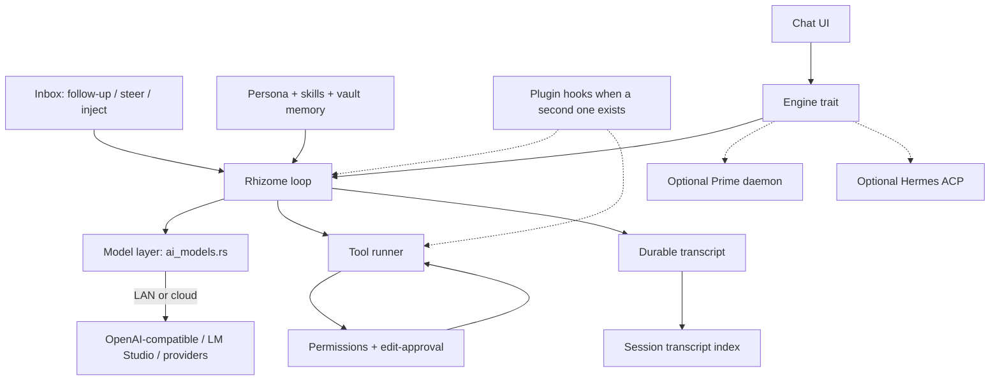

# Rhizome harness plan

**Origin:** Cursor Grok 4.6 · 2026-10-09 · implements ADR-0180
**Status:** plan only. This PR writes no product code.
**Binding decision:** [ADR-0180](../adr/0180-rhizome-is-its-own-harness.md) — Rhizome is its own harness. If that file is not on `main` yet, read it from open PR [#90](https://github.com/tuckcode/rhizome-agent/pull/90) (`docs/adr/0180-rhizome-is-its-own-harness.md` on branch `cursor/rhizome-own-harness-adr-4f1b`). Do not start Phase 1 until 0180 is the living identity, or knispo says to proceed against the PR.

This file is the implementation sequence ADR-0180 asked for. Read it cold. Do not reopen the identity question.

---

## 1. Goal and non-goals

**Goal.** Rhizome owns a native agent loop: turn-taking, tool calls, planning, and completion. It owns the tool runner, model routing, and (when a second plugin needs the same hook) a plugin seam. Prime and Hermes become optional engines behind one interface. Persona, skills, permissions / edit-approval, and Markdown memory stay Rhizome-owned, as ADR-0177 already held for the vault layer.

**Non-goals.**

- Do not replace Chat with a second window or a CLI-only harness.
- Do not vendor Cordis, fork DeepSeek Harness, or transplant Hermes / Prime as the Rhizome loop.
- Do not grow a second memory authority beside the vault. Do not write Rhizome memory into `~/.prime`.
- Do not decide #45 (model settings UI) or #48 (OmniRoute). ADR-0180 says re-read them; this plan does not pick their designs.
- Do not merge PRs. Do not mark this plan ready. Do not rebuild `/Applications`.
- Do not add a compatibility path for a stored value, filename, or env var without first finding an instance on disk.
- Do not speak `import_jsonl` into the Prime session list until Atticus types `1`.
- Do not cite ADR-0168 as a ban on a Rhizome loop. 0180 withdrew that lock. Borrow-care still holds.
- Do not reopen OpenCode as an engine. Atticus rejected that on 2026-08-29.
- Do not copy code under a licence that cannot sit under AGPL-3.0. MIT, BSD, and Apache-2.0 may be copied. Everything else is idea-only.

---

## 2. Architecture

The loop lives in Rust next to the pieces Rhizome already owns. TypeScript stays presentation.

| Piece | Owner | Starts from |
|---|---|---|
| Agent loop | Rhizome | new `src-tauri/src/rhizome_loop/` |
| Tool runner | Rhizome | new, then existing vault / note tools |
| Model / provider layer | Rhizome | `src-tauri/src/ai_models.rs` + `src/shared/aiModelProviderCatalog.json` (#56 closed as won't-remove) |
| Plugin seam | Rhizome | not in Phase 1; extract when the second plugin needs the same hook |
| Persona / profile | Rhizome | `settings::compose_agent_profile` / C66 `agent_profile` |
| Skills | Rhizome | vault `rhizome-vault` skill; progressive disclosure |
| Permissions / edit-approval | Rhizome | `AiAgentPermissionMode` (Limited tools / Power User); `acp_client/permission.rs` is the policy shape |
| Memory / transcript index | Rhizome | Markdown vault + `session_transcript_index.rs` (#81 / #86) |
| Optional Prime engine | Prime daemon | `prime_session_host.rs` (ADR-0163 transport stays) |
| Optional Hermes engine | Hermes ACP | `acp_client/` (ADR-0178) |

**Loop shape (borrowed idea, not copied code).** One inbox. A **turn** drains admitted input through zero or more **steps**. A step is one model request plus the tools it called. Durable facts (`turn/*`, `step/*`, user / assistant / tool) are separate from live coordination (`agent/*`). Model-visible means logged. Cancellation has a cause. Idle means the whole agent is quiet, not that one prompt returned.

**Engines.** The native loop is the product. Prime and Hermes implement the same small trait: start turn, stream events, steer, stop, settle-on-quit. They do not own permissions or memory. Chat talks to the trait, not to `prime_session_host` forever.

**Process lifecycle (do not contradict PR #88 / ADR-0179).**

- Default red X and Cmd+Q **quit** the Rhizome process and stop helpers this process started (`ws_bridge`, Mindwalk). A native-loop turn dies with that process unless knispo later grants a keep-running path.
- Settings → **Keep in taskbar** restores hide. Hide still stops `ws_bridge` and Mindwalk. A Prime daemon this process spawned stays warm on hide (C75). That is a hide grant, not a work grant.
- A user-started shared Prime daemon is never sent `shutdown` (ADR-0163). Closing Rhizome **detaches** from Prime.
- **Keep working** is today's Prime session grant (`promote_owned_session` then hide-or-quit). Whether a native-loop turn gets an equivalent is an open question. Do not invent one in Phase 1.
- Until #88 merges, leftover tests still lock hide-on-close strings in `lib.rs` and `parked-organs.test.ts`. Harness PRs do not rewrite close/quit.

**Local models.** knispo runs Qwen in LM Studio on a Windows PC (RTX 5090), OpenAI-compatible server on port **8080**. Rhizome runs on a Mac, so the client reaches that server over the **LAN**, not `localhost`. The catalog default `http://127.0.0.1:1234/v1` is a template only. Custom `base_url` (host + port + `/v1`) is required. Do not rewrite a LAN host to `127.0.0.1`.

---

## 3. Borrow table

Read the named sources before copying. Pins below are the HEAD this plan read on 2026-10-09. Re-check licence and SHA at copy time. Record every copied path in `docs/vendored-sources.md` (convention from ADR-0180 / PR #90) plus a file header: repo URL, exact commit, licence.

| Idea or piece | Source | Link | Licence | Mode | Why |
|---|---|---|---|---|---|
| Plugin system: services, typed events, reversible registrations; hook pre-step / request / tool / turn-stop without forking the loop | DeepSeek Harness (`dsh`) + Cordis | [architecture](https://github.com/deepseek-ai/deepseek-harness/blob/master/docs/architecture.md), [cordis primer](https://github.com/deepseek-ai/deepseek-harness/blob/master/docs/cordis-primer.md), [product](https://www.deepseek.com/harness/en/). HEAD read: `d743267388641bc76f17c45ce8b4c231aed1d32c` (0.2.1-alpha.2, 2026-10-09) | MIT (`LICENSE`, Copyright 2026 DeepSeek) | **Idea-only in Phase 1–2.** Library later only if a Node sidecar is an explicit product call. Do not mount Cordis inside Tauri. | knispo named this plugin system. `dsh` is a developer preview; the loop is TypeScript. A Rust host cannot take Cordis as a Cargo crate. Rebuild the *hooks* when the second plugin needs them. |
| Turn / step / inbox / durable vs live events; “model-visible means logged” | DeepSeek Harness | [architecture § Turn flow](https://raw.githubusercontent.com/deepseek-ai/deepseek-harness/master/docs/architecture.md) | MIT | **Idea-only** | Concrete loop vocabulary. Do not copy the TypeScript driver. |
| Custom OpenAI-compatible endpoint + LM Studio provider (`base_url`, optional key, `/v1/models` discover) | Hermes Agent | [providers](https://hermes-agent.nousresearch.com/docs/integrations/providers), [env](https://hermes-agent.nousresearch.com/docs/reference/environment-variables). HEAD read: `46d7718a52ff33accb15dc0501736fbdb6833cab` | MIT (Copyright 2025 Nous Research) | **Idea-only**; implement on `ai_models.rs` | Matches the LAN LM Studio job. Hermes default is `localhost:1234`; we must accept `:8080` on another host. |
| ACP adapter as an optional engine | Hermes Agent `acp_adapter/` | [server.py](https://github.com/NousResearch/hermes-agent/blob/main/acp_adapter/server.py), ADR-0178 | MIT | **Already a client, not a copy.** Keep `src-tauri/src/acp_client/` | Optional engine. Do not fork Hermes. |
| Children may narrow, never widen; fail-closed unattended approval; observable / interruptible work; `unknown` after crash | Hermes Agent | [delegation](https://hermes-agent.nousresearch.com/docs/user-guide/features/delegation), [security](https://hermes-agent.nousresearch.com/docs/user-guide/security) | MIT | **Idea-only** | Already product invariants in ADR-0168 borrow-care. |
| Hermes memory store, YOLO bypass, in-process unrestricted plugins | Hermes Agent | same | MIT | **Reject** | Second memory authority; safety-off; Tauri process injection. |
| Daemon attach / detach; `models.json` custom providers | Prime Agent (current engine) | this repo: `prime_session_host.rs`, `prime_custom_models.rs`; on-disk `~/.prime/agent/models.json` | MIT ([PrimeIntellect-ai/prime-agent](https://github.com/PrimeIntellect-ai/prime-agent/blob/main/LICENSE)) | **Keep as optional engine.** Do not copy Prime into the native loop. `models.json` stays Prime's catalog. | ADR-0163 transport is still true when Prime is used. |
| `Agent` + tool events + streaming | `@earendil-works/pi-agent-core` (Prime's lineage) | [npm](https://www.npmjs.com/package/@earendil-works/pi-agent-core) | MIT | **Library only if we add a Node sidecar.** Not a Tauri dependency in Phase 1. | Attractive crate, wrong language for the Rust loop. |
| Provider registry + SSE stream | Rhizome (already ours) | `src-tauri/src/ai_models.rs` | AGPL-3.0 (this repo) | **Keep / grow** | #56 starting point. Kinds already include `OpenAiCompatible` and `LmStudio`. |
| TokenJuice / Switchyard / Kern | parked | `docs/design/token-routing-and-compression.md`; AGENTS.md | various / Kern Linux-only | **Reject as organs.** Idea-only if a later phase needs shrink or hop. | leftover `parked-organs.test.ts` forbids vendoring TokenJuice / `kanban.db`. Kern is Linux/WSL2 only. |

Optional later ideas (do not schedule): Block Goose tool-confirmation recipes (Apache-2.0, idea-only); Hermes progressive skill disclosure (already vault-shaped).

---

## 4. Phases

One phase per PR. Each phase deletes the path it replaced in that same PR. Coverage: new Rust stays inside `cargo llvm-cov --fail-under-lines 85` (GitHub Actions `rust-quality` on every PR). Frontend leftover locks in `src/lib/parked-organs.test.ts` and `src/lib/leftover-*.test.ts` stay green until Phase 6, when Chat actually moves.

### Phase 1 — Bare loop + CI behavior tests

**Scope.** A Rhizome-owned loop that no Chat path calls yet. Fake model. No tools. No plugins. No Prime.

- Admit one user message.
- Call the model.
- Append assistant text.
- End the turn.
- Cancel mid-stream with a cause.
- A second message before idle queues as follow-up (inbox), not a second loop.
- Persist a durable event list in memory (Vec). Disk comes with the transcript index later.

**Files likely touched.**

- Add `src-tauri/src/rhizome_loop/{mod.rs,types.rs,driver.rs,fake_model.rs}`
- Register the module in `src-tauri/src/lib.rs` only if needed for compile. Prefer `#[cfg(test)]` visibility so Chat cannot import it yet.
- Tests in the same module (`#[cfg(test)]`). Do not add a leftover lock that claims Chat uses this loop.

**Done when.**

- `cargo test --manifest-path src-tauri/Cargo.toml rhizome_loop` is green.
- GitHub Actions `rust-quality` on the PR runs those tests (they are ordinary `#[test]`; no new workflow).
- `rg 'rhizome_loop' src/ src-tauri/src/commands src-tauri/src/prime_session_host.rs` finds no Chat / Prime wiring.
- Chat still talks to Prime. `parked-organs` “Chat on Prime when Settings default is an API model” still passes.

**Behavior tests (must fail if the loop is deleted).**

1. `one_user_message_yields_one_assistant_and_turn_end` — fake model returns `"ok"`; events are `user`, `assistant`, `turn_end`.
2. `cancel_stops_before_a_second_chunk` — fake model streams two chunks with a yield; cancel after the first; no second chunk; event `cancelled { cause }`.
3. `follow_up_waits_until_idle` — send B while A is in flight; B is not visible to the model until A’s `turn_end`.
4. `idle_means_inbox_empty_and_no_step` — `when_idle()` is false during a step and true after drain.

Paste the failing `cargo test` (red) and the passing run (green) in the PR body.

### Phase 2 — Tools + permissions

**Scope.** The loop can call tools. Rhizome policy decides allow / deny / ask. Limited tools vs Power User keep those names (C57). Unattended / no-UI deny is fail-closed.

**Files likely touched.**

- `src-tauri/src/rhizome_loop/tools.rs`, `policy.rs`
- Reuse `AiAgentPermissionMode` in `src-tauri/src/ai_agents.rs`
- Reuse the decision table in `src-tauri/src/acp_client/permission.rs` (do not delete ACP; copy the *policy*, or extract a shared function)
- First real tools: read-note / create-note already bounded by the vault (`ai_models.rs` already has a narrow `create_note`). No shell in Limited tools.
- Do not hide or show the Prime permission toggle. That leftover stays until Phase 6.

**Done when.**

- A scripted model that emits one tool call then a final text completes the turn with `tool_result` in the log.
- Limited tools: a `bash`-class tool is not offered and a forced call is denied.
- Power User: the same tool runs once when the policy says allow-once.
- Empty option list or timeout without a human → deny (fail-closed).
- Children of a tool (if any) cannot enable a tool the parent lacked.

**Behavior tests.**

1. `tool_then_text_completes_one_turn` — fake model: tool_call `echo` → text; log has tool_result then assistant.
2. `limited_tools_denies_shell` — `bash` denied; turn still ends with a visible denial event.
3. `power_user_allow_once_runs_echo` — echo runs; second identical call without a new grant is denied or re-asked (pick one in the test name; do not silently allow-always).
4. `no_ui_timeout_denies` — approval waiter returns cancelled; tool does not run.

### Phase 3 — Plugin seam (only when the second plugin needs it)

**Scope.** Do not open this phase with a framework. Ship Phase 2 with one in-line hook if needed (policy *is* that hook). Open Phase 3 when a **second** caller wants the same point (example: persona/skills injector + policy, or a logging interceptor + policy).

Then extract, do not speculate:

- Named hook points only: `pre_step`, `on_request`, `pre_tool`, `post_tool`, `turn_stopping`.
- A plugin is a Rust trait object registered for this process. No in-process third-party script load.
- Registrations unwind on drop (DeepSeek / Cordis idea).
- Do not make the loop itself a plugin. Do not add profiles, bundles, YAML patches, or HMR.

**Files likely touched.** `src-tauri/src/rhizome_loop/hooks.rs`; move the Phase 2 policy listener onto the trait; add the second plugin (persona/skills prompt section from `compose_agent_profile` + vault skill metadata).

**Done when.** Two plugins are registered in a test, one can reject a tool, one can append a system section, and removing either does not require editing `driver.rs`.

**Behavior tests.**

1. `second_plugin_blocks_a_tool_without_editing_driver` — register a deny plugin; `echo` is blocked; driver file is not matched by the deny logic (the plugin owns it).
2. `persona_plugin_prepends_profile` — `compose_agent_profile` text is the first system section the fake model sees.
3. `drop_unregisters` — after drop, the deny plugin no longer fires.

If only one hook exists, **close this phase as skipped** in the PR and say so. Do not merge an empty framework.

### Phase 4 — Model layer (custom endpoints / LM Studio)

**Scope.** Grow `ai_models.rs` into the loop’s model backend. Chat still does not use the native loop.

- Keep kinds: OpenAI, Anthropic, OpenAI-compatible, Ollama, LM Studio, OpenRouter, Gemini.
- Custom endpoint: user-supplied `base_url` (scheme + host + port + path). LAN hosts are valid. `http://192.168.x.x:8080/v1` is the dogfood shape.
- LM Studio catalog default may stay `127.0.0.1:1234` as a blank template. A saved custom URL wins. Do not add a silent `:8080` alias unless a settings file on disk already has it (standing hold).
- Discover models via `GET {base_url}/models` when the user asks. Do not cache a failure (`primeModelCatalog.ts` already says this for Prime; match it).
- Optional API key for local servers. Do not send a cloud key to a custom origin.
- Streaming + tool-call deltas enough for Phase 2’s fake-model contract.

**Files likely touched.** `src-tauri/src/ai_models.rs`, `src/shared/aiModelProviderCatalog.json`, tests in `ai_models.rs`. Settings UI only if a field is missing for `base_url`; do not redesign #45.

**Done when.**

- Unit tests cover URL normalize (trim, strip trailing slash, reject empty custom URL).
- A test with a local `httptest` / mock listener on a non-loopback-looking host string (`192.168.1.50:8080`) proves the client calls that URL, not `127.0.0.1:1234`.
- Tool-call streaming from an OpenAI-shaped payload is parsed into the loop’s tool_call events.

**Behavior tests.**

1. `custom_base_url_is_used_verbatim` — mock server; request URL starts with the supplied LAN base.
2. `empty_custom_url_errors` — already sketched in `custom_provider_requires_base_url`.
3. `failed_discover_is_not_cached` — first list fails, second list is attempted.
4. `openai_tool_call_delta_becomes_loop_event` — fixture JSON from a Qwen/LM Studio-shaped stream.

Live LAN dogfood is **not** a CI gate. Note it in the PR if someone ran it.

### Phase 5 — Optional engines behind one interface

**Scope.** One trait. Three implementors: `RhizomeEngine` (native loop), `PrimeEngine` (`prime_session_host.rs`), `HermesEngine` (`acp_client/`). Chat still calls Prime directly. This phase only introduces the trait and adapters, plus tests.

**Files likely touched.**

- Add `src-tauri/src/engines/{mod.rs,native.rs,prime.rs,hermes.rs}`
- Thin wrappers. Do not rewrite `prime_session_host.rs` (~9k lines). Do not change ACP protocol.
- Map settle-on-quit: Prime keeps `settle_session_on_quit` / Keep working. Native maps quit → cancel turn (until the open question is answered). Hermes detaches ACP stdio.

**Done when.** A table-driven test drives each engine with a fake or recorded fixture: start, one text event, stop. Prime tests stay fixture / mock-daemon (existing style). No Chat import of `engines::` yet.

**Behavior tests.**

1. `native_engine_start_stop` — same as Phase 1 through the trait.
2. `prime_engine_detaches_on_drop` — mock daemon sees `detach`, never `shutdown`.
3. `hermes_engine_uses_acp_client` — existing ACP fixture, not `hermes chat --quiet`.

### Phase 6 — Migrate Chat paths, then delete the dead ones

**Scope.** Product-visible. **Stop and ask** before this PR: which engine is the Chat default? leftover locks today require Chat to stay on Prime when the Settings default is an API model (`ChatHome.tsx`, `parked-organs.test.ts`). Updating those locks is part of this phase, not a drive-by.

Suggested default until knispo says otherwise: Chat stays on Prime; a Settings or composer control can select “Rhizome” (native) or “Hermes”. Do not strip Prime chrome in the same PR as the first native send unless he says to.

**Files likely touched.** `src/components/ChatHome.tsx`, `AiPanel.tsx`, `src-tauri/src/commands/ai.rs`, `ai_agents.rs` dispatch, leftover tests that name Prime-only Chat. Session list / transcript index must accept native-loop transcripts without writing `~/.prime`.

**Delete in this phase (only what this phase replaced).**

- Dead `hermes chat --quiet --source tool` fallback once ACP + native cover the Hermes target on a real install (ADR-0178 already marked it fallback).
- Any `ai_agents` branch that spawned a one-shot and hid the turn, if the trait path is the only caller.
- Do not delete `prime_session_host.rs`. Do not delete `acp_client/`. Do not delete `ai_models.rs`.

**Done when.**

- One Chat send can complete a native-loop turn with a fake or recorded model in tests.
- Prime Chat still works through the engine trait (no second host).
- Leftover tests updated in the same PR as the Chat change, with the product call quoted.
- Session transcript index records native turns (#81 / #86 path).
- `pnpm test` leftover suite green.

**Behavior tests.**

1. `chat_native_target_uses_rhizome_loop` — mock Tauri command; no Prime socket.
2. `chat_prime_target_still_detaches_not_shutdown`.
3. `transcript_index_contains_native_turn`.

**Standing delete rule for every phase.** When a function has no caller after the new path lands, delete it in that PR. Do not leave a “compat” alias without a file on disk that still needs it.

---

## 5. Risks and open questions

**Risks**

- Leftover tests will fail if Chat leaves Prime before Phase 6 updates them. That is the intended brake.
- `prime_session_host.rs` is huge. A rewrite will stall the loop. Wrap it.
- DeepSeek Harness is a preview (`0.2.1-alpha.2` when read). Copying it would import a moving API. Idea-only is the safe mode.
- Two memory files (`~/.prime` jsonl vs vault index) already exist. The native loop must write Rhizome’s index, never Prime’s.
- LAN LM Studio: bind address, firewall, and HTTP-not-HTTPS are machine facts. CI cannot prove them.
- PR #88 and #90 both edit living docs. Rebase this plan (and later phases) after they merge. Do not “fix” #88 hide/quit from a harness PR.
- Rust coverage is a ratchet (≥85%). An untested driver will fail `rust-quality`.

**Open questions for knispo (do not decide in code)**

1. When does Chat default to the native loop? First day, a toggle, or only after Prime is gone from daily drive?
2. Does a native-loop turn survive **Keep in taskbar** hide? Does it get a **Keep working** grant, or does quit always cancel it?
3. Plugin language: Rust-only in-process (this plan), or a later Node sidecar so Cordis / `dsh` plugins could load?
4. #45: is the next model-settings UI the Rhizome catalog (`ai_models.rs`), Prime’s `models.json`, or both until Phase 6?
5. #48 OmniRoute: still wanted as a local gateway, or is a custom OpenAI-compatible URL enough?
6. C66 profile: one installation-wide Settings profile (leftover lock today) or per-engine / vault `AGENTS.md`?
7. Should Phase 1 wait for #90 to merge, or may implementation branch from 0180-on-the-PR?
8. Windows LM Studio dogfood: which LAN URL and model id should Settings show as the example (port 8080, not 1234)?

---

## 6. How a coding agent should work this plan

1. Read ADR-0180, then this file, then the leftover tests named in the phase you are in. Identity is 0180. Vault-layer ownership from 0177 still holds. Close/quit follows ADR-0179 / PR #88.
2. **One phase per PR.** Title `feat: rhizome loop phase N — <short>`. Base `main`. Draft until the owner says ready. **Never merge.**
3. TDD: write the behavior tests first. Push a commit where they fail. Paste that run in the PR. Then implement. Paste the green run.
4. Small diffs. Do not rewrite `prime_session_host.rs` or Chat chrome in Phase 1–5.
5. Stage files by name. `git commit -- path/to/file`. Co-Authored-By trailer for the model that wrote the change. Never `--no-verify`.
6. Copied code: header + `docs/vendored-sources.md` row. Licence check first. Prefer a crate over a copy.
7. Product questions in §5: **stop and ask.** Silence is not approval.
8. Do not update leftover locks until the product call that they encoded has changed.
9. English only. No `en.json` migrations (C18). No PostHog event for an unexposed loop; add one when Chat can start a native turn (suggested name: `chat_native_turn_started`, no prompt text).
10. After each phase: delete the replaced path; run the tests that prove the new path; leave Prime and Hermes adapters intact until a later explicit removal PR.

---

## Pointers

- ADR-0180 (binding): `docs/adr/0180-rhizome-is-its-own-harness.md` or [PR #90](https://github.com/tuckcode/rhizome-agent/pull/90)
- ADR-0179 close/quit: [PR #88](https://github.com/tuckcode/rhizome-agent/pull/88)
- ADR-0163 Prime transport, ADR-0167 client-owned sessions, ADR-0178 ACP
- Vendored index (once #90 lands): `docs/vendored-sources.md`
- Existing reviews (older identity; use for source maps, not for “Prime is the only loop”): `docs/plans/2026-08-24-deepseek-harness-source-review.md`, `docs/plans/2026-08-24-hermes-harness-source-review.md`
